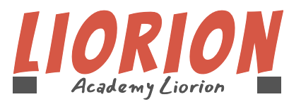
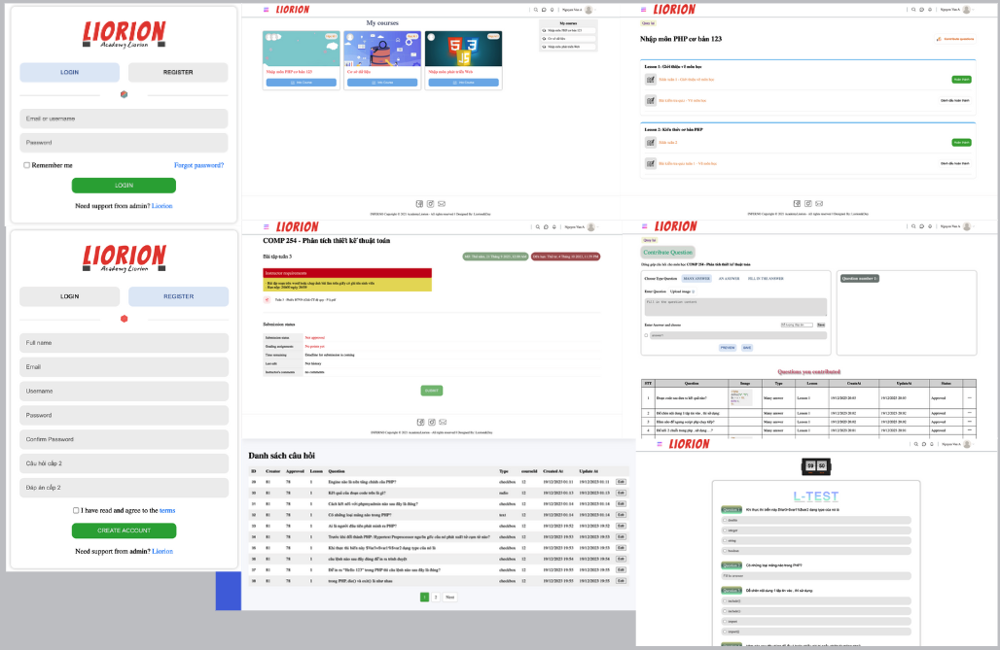

# CNW

## Mô tả dự án

Dự án "Academy Liorion" là một hệ thống quản lý học tập (LMS) được phát triển bằng công nghệ PHP thuần và SQL. Hệ thống này được thiết kế để cung cấp một nền tảng học tập toàn diện, cho phép người dùng quản lý quá trình học tập của mình một cách hiệu quả. Academy Liorion không chỉ giúp người dùng theo dõi tiến độ học tập mà còn cung cấp các bài kiểm tra để đánh giá kiến thức và kỹ năng của họ.

Academy Liorion hoạt động tốt trên cả máy tính để bàn và thiết bị di động, mang đến trải nghiệm học tập linh hoạt cho người dùng.

**Các tính năng chính:**
- Người dùng có thể tạo và quản lý các khóa học, bao gồm tài liệu học tập và bài kiểm tra.
- Hệ thống cho phép người dùng theo dõi tiến độ học tập và nhận phản hồi chi tiết về kết quả bài kiểm tra.
- Các bài kiểm tra được thiết kế với nhiều dạng câu hỏi khác nhau, từ trắc nghiệm đến tự luận, giúp người dùng củng cố kiến thức một cách hiệu quả.

## Công nghệ sử dụng:
* [PHP:](https://www.php.net/) Ngôn ngữ lập trình phía máy chủ phổ biến, được sử dụng để phát triển các ứng dụng web động.
* [MySQL:](https://www.mysql.com/) Hệ quản trị cơ sở dữ liệu mã nguồn mở, cho phép lưu trữ và quản lý dữ liệu một cách hiệu quả.
* [HTML/CSS:](https://www.w3.org/standards/webdesign/) Công nghệ cơ bản để xây dựng giao diện người dùng, đảm bảo tính thân thiện và dễ sử dụng cho người học.

## [Hướng dẫn cài đặt](https://drive.google.com/file/d/1InLIHxG_A2SMXYC8bMfvmKvZ0uMRdXOm/view?usp=sharing/)

# Demo
[(./)](./images/screens/demo.mp4)
